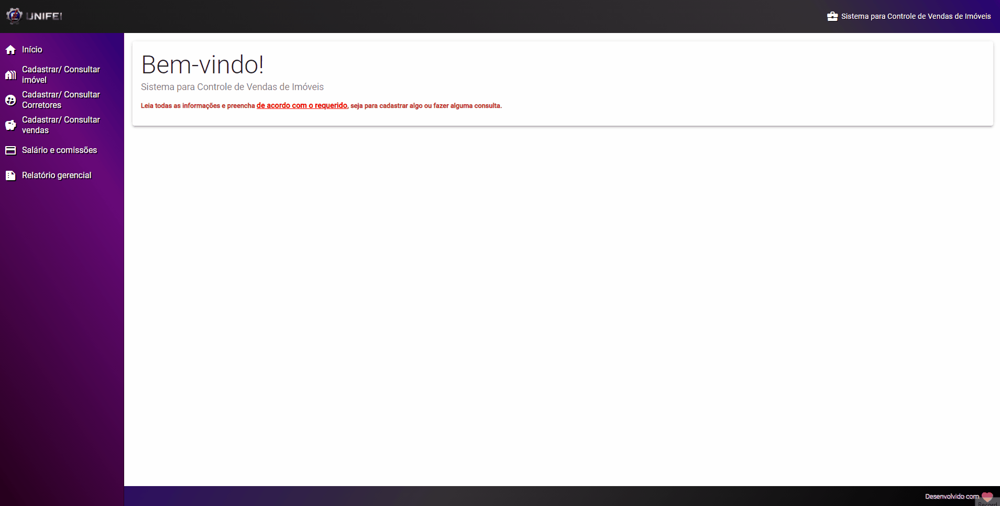

# ControlaVendas®


## :boom: Este é trabalho final da disciplina COM222 - Desenvolvimento Web!

## :closed_book: Informações do trabalho

### É um Sistema para Controle de Vendas de Imóveis

- Disciplina: Desenvolvimento Web
- Professor: Laercio Baldochi Júnior
- Universidade: Unifei - Universidade Federal de Itajubá

## :construction_worker: Desenvolvido Por

```
Carlos Henrique Souza Silva, curso de Sistemas de informação
-> Matrícula: 2019015979

Fauzi Consoli Esper, curso de Sistemas de informação
-> Matrícula: 27497

Flávio Mohallen, curso de Sistemas de informação
-> Matrícula: 35036

João Lucas Ribeiro, curso de Sistemas de informação
-> Matrícula: 2019005856

Robson de Arruda Silva, curso de Sistemas de informação
-> Matrícula: 2019013624
```

## :information_source: Como foi implementado ?

    Neste trabalho, foi implementado um sistema para gestão de vendas de imóveis a ser utilizado por uma
    imobiliária. A empresa que solicitou o sistema trabalha com a venda de imóveis rurais e urbanos. Os
    imóveis comercializados são dos seguintes tipos: casa, apartamento, sala comercial, lote, chácara, sítio
    e fazenda. Este sistema é capaz de cadastrar os imóveis à venda, com os seguintes atributos: código, tipo,
    descrição, nome do vendedor (proprietário), preço solicitado, imagem e data de cadastro (campo livre para
    digitação).

<div align="center">
  
</div>

## :computer: Tecnologias utilizadas

### >MEAN stack

- M - Mongo
- E - Express
- A - Angular
- N - Node

### >Linguagem: Typescript

## :dart: Passo a passo para executar o projeto

## Como clonar o repositório?

Basta abrir o git bash ou o terminal e executar o comando:

`git clone https://github.com/carloshssouza/TrabalhoFinal-web.git`

Em seguida, abra um terminal ou git bash a partir da pasta gerada do git clone

## Instalação dos pacotes

### Front-end:

- Navegue para o diretório client, utilizando o comando: `cd client`
- Execute o comando: `npm install`

### Back-end:

- Retorne um diretório, utilizando o comando: `cd ..`
- Navegue para o diretório server, utilizando o comando: `cd server`
- Execute o comando: `npm install`
- Mantenha o terminal aberto.

# :trophy: Pronto, os pacotes foram instalados!

## Agora, para configurar a pasta de dados do mongodb:

- No diretório server, crie um diretório chamado: `data`

- Procure, no seu computador, o diretório bin do mongodb

  `(Se o mongodb foi instalado de maneira padrão, geralmente fica em C:\Program Files\MongoDB\Server\4.4\bin)`

- Abra um terminal a partir desse diretório

- Pegue o endereço do diretório 'data' criado anteriormente no diretório server

- Agora, no terminal que foi aberto na pasta bin do mongodb, execute o seguinte comando:

  `mongod --dbpatch endereco-diretorio-data`

### Para iniciar o backend:

- No terminal, navegue para o diretório server
- Execute o comando: `npm start`
- Será inicializado o backend da aplicação.

### Para iniciar o frontend:

- No terminal, navegue para o diretório client
- Execute o comando: npm start
- Será inicializado o frontend da aplicação (pode demorar alguns segundos/minutos, devido a compilação do Angular), logo após vá no navegador e entre no endereço indicado no terminal pelo Angular (por padrão é http://localhost:4200/)

## :rocket: Caso desejar iniciar os dois de uma vez:

- Navegue para o diretório do server e execute o comando: `npm run dev`
- Será iniciando o backend e o frontend automaticamente, o frontend da aplicação pode demorar alguns segundos/minutos, devido a compilação do Angular, logo após vá no navegador e entre no endereço
  indicado no terminal pelo Angular

`(por padrão é http://localhost:4200/)`

# :trophy: Sucesso! O sistema já está rodando na sua máquina!
